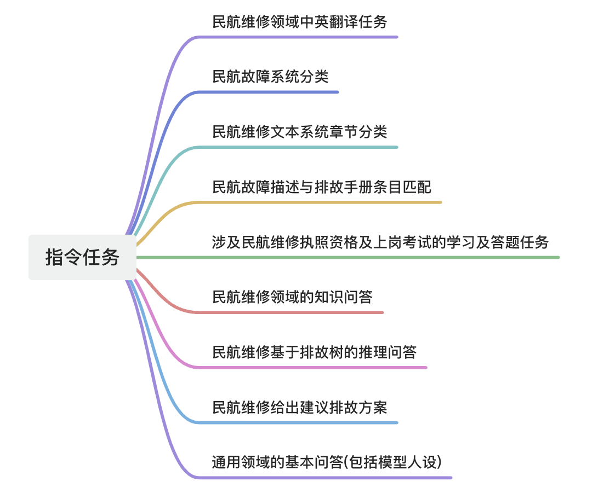
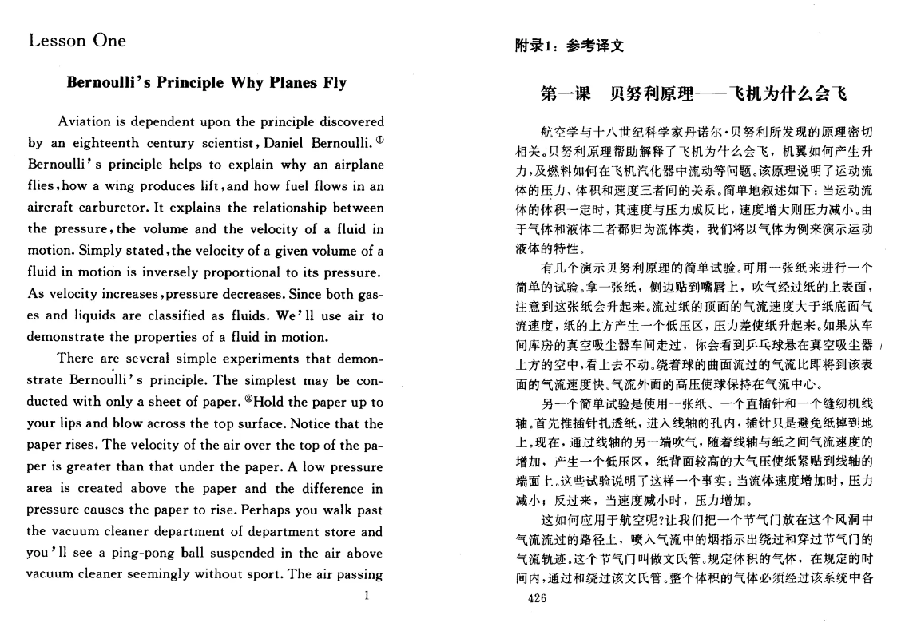
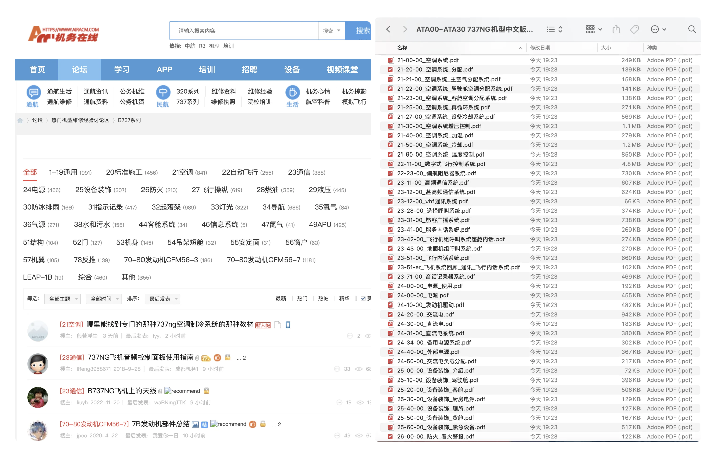
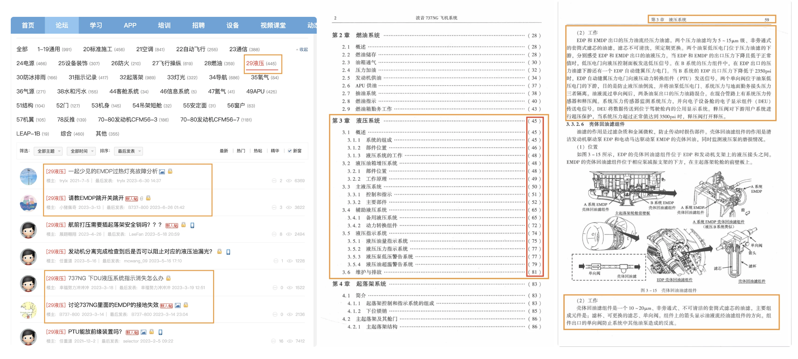
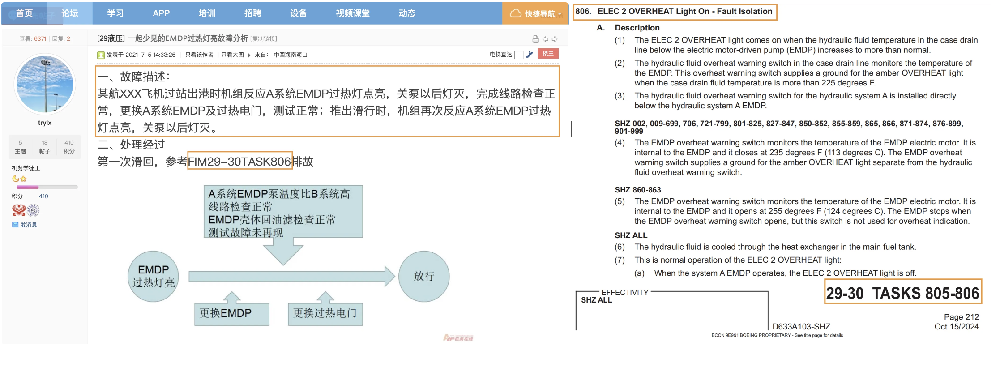
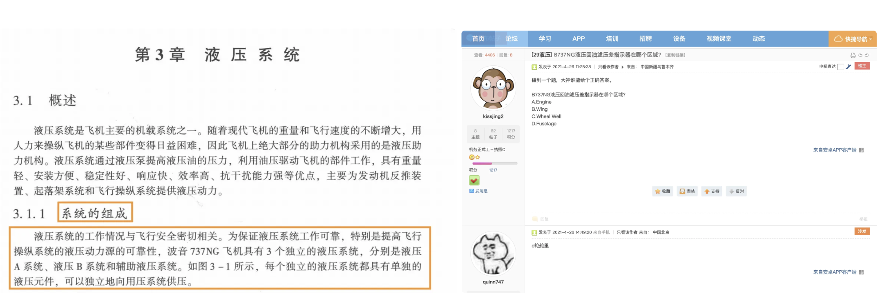
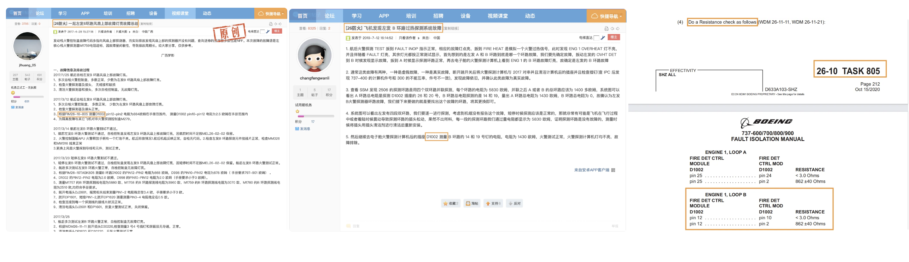
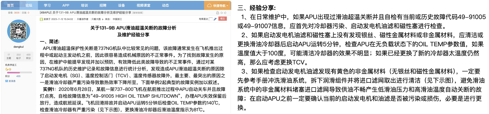
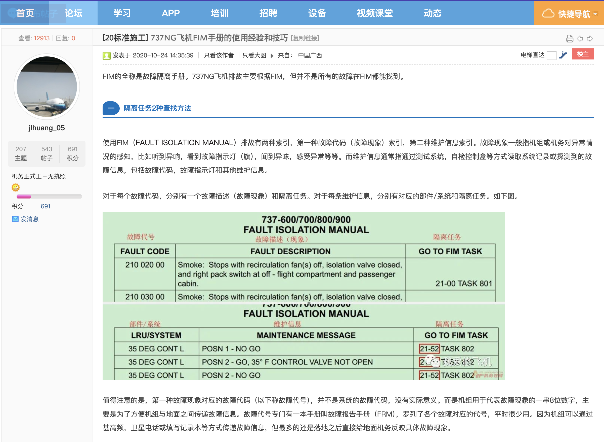
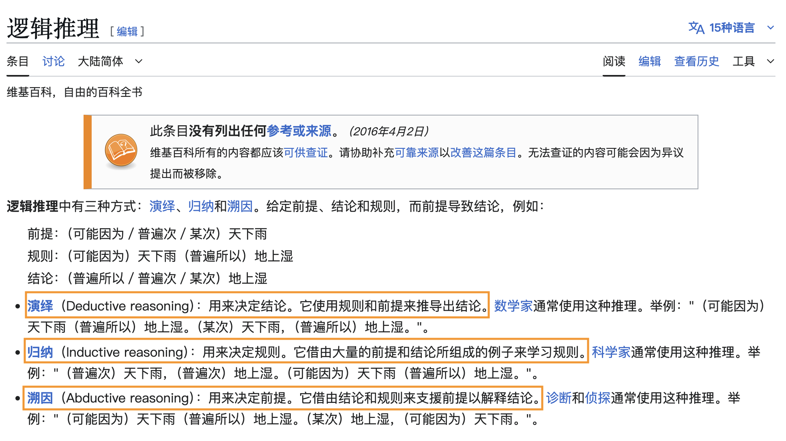

# 民航维修大模型监督微调(SFT)
## 背景
针对民航维修领域，在构建了 [CAMB](https://github.com/CamLLM/CamBenchmark) 民航评估基准之后，我们发现现阶段模型均缺乏民航维修领域的专业知识。在经过以补入领域知识为目的的持续预训练之后，我们需要进一步监督微调，对齐现实业务中的指令任务。

## 监督微调数据构建标准
在构建 [CAMB](https://github.com/CamLLM/CamBenchmark) 基准时，已经拆解了现实业务的场景，将其映射到大模型擅长处理的自然语言任务上，并建立完备了适合大模型完成的指令任务集，如下所示：

 

此外，我们清楚，大模型的监督对齐阶段，主要是激发 LLM 在预训练或者持续预训练阶段学习到的知识。因此，我们在上述指令任务集 Schema 的约束下，从与[预训练同源的数据源](https://github.com/CamLLM/CamCPT/tree/main?tab=readme-ov-file#%E9%A2%84%E8%AE%AD%E7%BB%83%E6%95%B0%E6%8D%AE%E6%94%B6%E9%9B%86)中挖掘监督对齐数据。

## 监督微调数据源构建
### 民航维修领域中英翻译
针对此任务，有相当量的民航维修领域的中英双语对齐语料可以利用，从词语、短语、句子到段落，甚至篇章粒度。再结合“中英翻译任务”的真实使用环境，构建多样的、丰富的 prompt 指令即可。具体做法参照[之前类似工作](https://codeaspoetry.github.io/2023/07/01/sft_translate/)。

> **Note：**
> [民航英语教材-辞典-对齐术语 PDF 目录](https://github.com/CamLLM/CamCPT/tree/main/pt_data_collect/%E6%B0%91%E8%88%AA%E8%8B%B1%E8%AF%AD%E6%95%99%E6%9D%90%26%E8%BE%9E%E5%85%B8%26%E5%AF%B9%E9%BD%90%E6%9C%AF%E8%AF%AD)

民航中英对齐双语数据(点击查看图片)

 

 

### 民航故障系统分类 & 民航维修文本系统章节分类
这两个任务都是文本分类任务，并且来自各数据源的民航维修文本基本都是以飞机系统为章节进行组织，因此两个任务的标签体系都一样。

标签体系如下图所示：

两个任务基本一致的标签体系(点击查看图片)

 

对于民航故障系统分类，只需要按照[机务在线](https://www.airacm.com/thread/103/) 已经分好的飞机系统 tag 进行抓取，并从其中过滤出我们需要的关于飞机故障描述的帖子；而对于文本系统章节分类，只需要在不同系统章节目录和对应页码文本采样即可。

故障&文本系统分类监督数据(点击查看图片)

 

### 民航故障描述与排故手册条目匹配

对于此任务，依然可以按照机务在线论坛已经分好的飞机系统 tag 进行抓取，并从其中过滤出我们需要的关于飞机故障描述并附带具体手册排故条目的帖子。而 FIM 或者 TSM 的排故手册，也正是按照“系统章节号-子系统编号-任务号”来组织，很快便能将二者对应上。

故障描述与手册条目匹配监督数据(点击查看图片)

 

### 民航维修执照及上岗考试的学习 & 领域知识问答

针对这两个任务，既可以通过抓取机务在线论坛并筛选高质量的问答对来获取，也可以利用高质量教材的目录和大小标题以及对应的正文内容构建，还可以利用大模型数据合成，将高质量的教材文本块作为答案 A 送入，通过 prompt 指令获取问题 Q 并从中筛选。

考试&领域知识问答数据(点击查看图片)

 

### 民航维修基于排故树的推理问答
针对此任务，民航维修的排故树构建成本是高昂的，当缺乏维修工程师支持时，基本是不太可能的。然而，当我们积累了排故案例，手册，教材等等数据源，跨源对齐来自动构建出高质量的树结构样本数据，也是很有希望的。相对于构建整棵树，从更多的排故数据中，构建一条从根节点到叶子结点的逻辑排故路径是容易的。只需要借助大模型的抽取能力，按照时序和排故逻辑抽取出来。当发现多条路径有共同的节点，便可以合并成一颗排故树。

排故树推理问答(点击查看图片)

 

### 民航维修给出建议排故方案
此任务对模型能力的要求是以上述几个任务为基础的，要求模型在给出民航飞机故障描述时，会分类到相关系统，获取到章节系统的文本，匹配到可能的手册上排故条目等，也包括相似的排故案例参考等。不管是机务在线论坛还是民航维修相关的维修案例总结等，都有相当量的数据样本。数据展示如下图，[具体来源点击在此](https://www.airacm.com/read/408070/)。

给出建议排故方案(点击查看图片)

 

至于如何让模型看懂排故手册，如 FIM 、TSM 等，也有相关的数据可以利用起来，甚至可以用来指导构建 prompt 指令。

如何使用手册(点击查看图片)

 

### 通用领域的基本问答(包括模型人设)
此数据源网上开源甚多，在 huggerface 或者 modelscope 上开源的指令问答 SFT 数据集。再加上希望模型关于自身人设能给出合理的预期答案，我们加以建设，最终控制好比例，随着上述几个任务一起喂入模型进行指令监督训练。

## 指令(prompt) & 思维链(CoT)构建 

众所周知，民航排故背后蕴含着大量逻辑推理。逻辑推理主要有演绎、归纳、溯因等几种模式。

逻辑推理几种模式(点击查看图片)

 

而排故场景属于其中的溯因推理，对与溯因推理，往往有如下的思维步骤：
1. 观察现象：首先，观察到一个需要解释的现象。
2. 提出假设：基于现象，提出一个或多个假设来解释该现象。
3. 推导结论：从假设出发，推导出一些可以验证的结论。
4. 验证假设：通过实验或观察验证这些结论。如果结论被证伪，则假设为假；如果结论被验证为真，则假设可能为真

以民航维修排故场景来看，观察到的现象就是“民航飞机的故障描述”，可以是“飞机各类传感数据、指示参数、显示器的日志及代码”，也可以是“异响、异味”等等具体的情形描述。根据“故障描述”给出“故障出现的可能的系统”，给出“可能需要参考的手册条目”等，就属于“提出假设”。随后便需要进一步结合系统工作原理等分析，推导出结论。有的需要做一下测试，根据结果确定，这也是排故手册条目下对应的一部分操作，用来故障确认。最后，结合故障描述、原理、手册等，进行分析，验证假设。最终形成“排故建议报告”。

对于溯因推理思维链(COT)的构建，还有多种细分模式，如“从目标拆解”、“从条件逐步”、“反思”、“反证”，“因果分析”等，甚至还会和“演绎推理”和“归纳推理”相互结合。比如，对于根据之前大多类似的故障得到的排故措施尝试解决当下故障，就属于“归纳推理”；根据一般性质的工作原理结合各类参数及测试结果推断出故障的症结所在，便是“演绎推理”。

确定推理模式后，我们可以获取开源的包含思维链的SFT推理数据，从中挑选出高质量的类似目标模式的数据，也可以蒸馏 DeepSeek-R1 的数据，甚至可以用大模型结合前一章节各种任务的监督数据，自动构建出符合目标推理模式的思维链(COT)数据。

## 监督微调模型实验

### 探索性实验
#### 实验一：自动合成的目标溯因推理模式COT数据的有效性验证

* 数据集：[qwen3_training_data_1000_items.jsonl](data/qwen3_training_data_1000_items.jsonl)
* 监督微调训练脚本
    * 以 Qwen3-32B 为代表的 Dense 模型的 [Lora 微调](scripts/qwen3_lora-32B.sh)
    * 以 Qwen3-235B-A22B 为代表的 MoE 模型的[Lora 微调](scripts/qwen3_moe_lora_235B.sh)
    * 以 Qwen3-30B-A3B 为代表的 MoE 模型的[全参 SFT 微调](scripts/qwen3_moe_full.sh)和[Lora 微调](scripts/qwen3_moe_lora.sh)
* 实验结果：
    1. 在 Dense 模型的 Lora 微调下，指标提升了 绝对 7 个百分点，证明自动合成目标推理模式数据的有效性
    2. 在 MoE 模型上的 Lora 微调接近没有提升，分析原因推测是“稀疏专家”独立性更强，统一的加个 Lora 层，不仅无益，可能有害，应该单独加在某几个与目标任务更相关的专家上，或者采用“专家监督微调”
    3. 更强大的专家监督微调技术框架可以参考 DeepSeek 之前开源的 [ESFT](https://github.com/deepseek-ai/ESFT)
